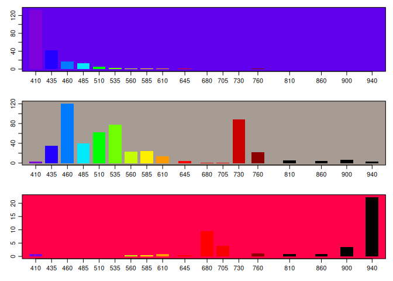

SSI
================
Peter Hoff
2023-04-07

### Spectral sensor Interface

This package provides an interface to the AS7265x spectral sensor, which
is a low-cost chipset that provides 18-channel readings of the intensity
of light at wavelenghts ranging from ultraviolet to infrared. This
package communicates with the sensor with AT commands through the UART
interface. This requires the I2C interface to be disabled and UART to be
enabled, which can be accomplished by disconnecting some jumpers and
connecting others.

### Installation

``` r
# Development version 
devtools::install_github("pdhoff/SSI")   
```

### Basic usage

``` r
library(SSI) 
getSpecMat(plot=TRUE)
```

<!-- -->
